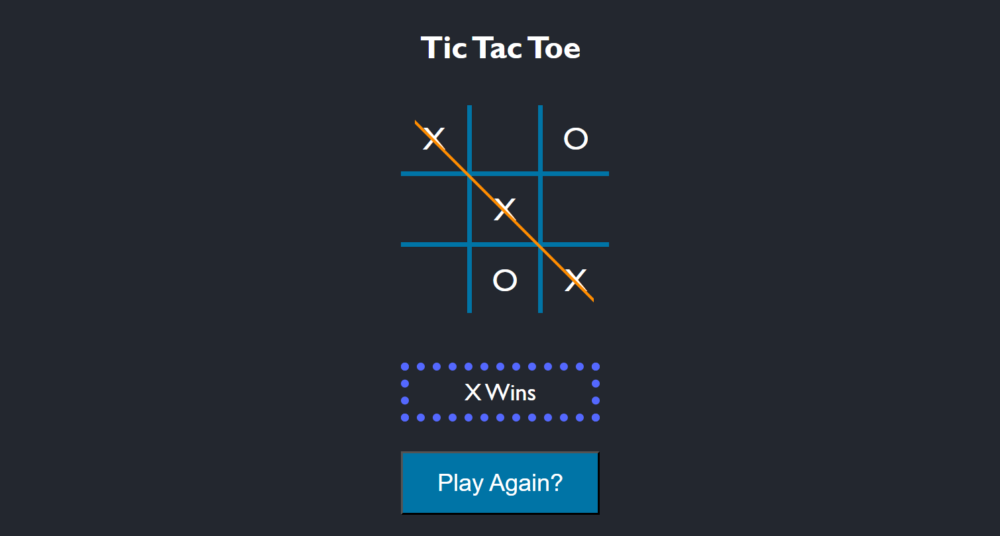

# Tic Tac Toe (React)

A Tic Tac Toe game built with React while following a guided tutorial, focused on learning core React concepts like state management, hooks, and component structure.

## About

This project was my first hands-on React build after learning the fundamentals. Following the tutorial, I implemented the game logic and component structure while working through how state, props, and hooks connect components together.

## Features

- Interactive 3x3 game board
- Turn-based gameplay (X and O)
- Win detection logic
- Game state reset
- Sound effects on move/win
- Responsive layout using Flexbox/Grid

## Technologies Used

- React
- Vite
- CSS (Flexbox/Grid)
- JavaScript (audio handling)

## What I Learned

- Thinking in components — breaking the UI into `Board` and `Tile`
- Managing state with the `useState` hook
- Using the `useEffect` hook for side effects
- Prop drilling — passing state and functions down through components
- Conditional rendering (displaying turn/winner status)
- Updating arrays immutably instead of mutating state directly
- Structuring a small React app from scratch using Vite

## Getting Started

```bash
git clone <your-repo-link>
cd <project-folder>
npm install
npm run dev
```

Then open the local URL shown in your terminal (usually `http://localhost:5173`).

## Preview



## Credits

This project was built as a learning exercise while following **Build an Awesome Version of Tic Tac Toe in React** tutorial.

## Disclaimer

This project was created for educational purposes to practice and understand React fundamentals (state, hooks, component structure) before moving on to original project work.